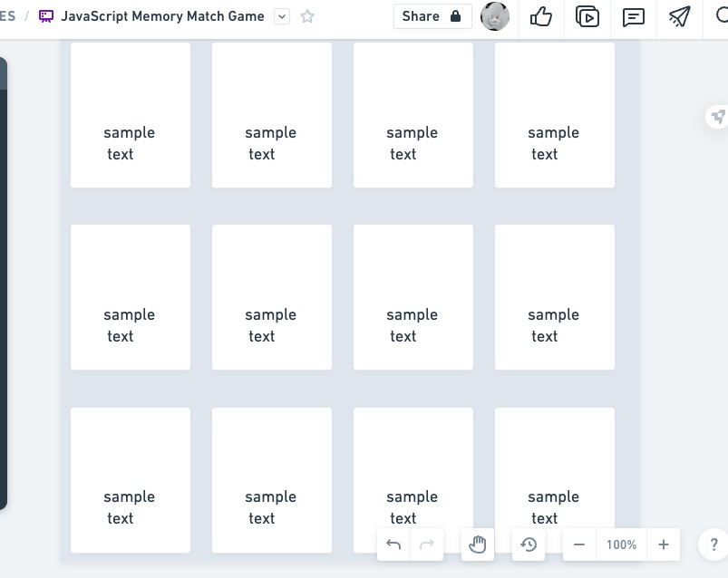

JavaScript Memory Match Game README FILE: 

This is a Memory Match Game built using HTML, CSS, and JavaScript. The game involves flipping over pairs of cards to find matches. 
The cards are images of different JavaScript libraries and frameworks. The goal of the game is to find all the matches in the shortest time possible.

##MVP (Minimum Viable Product):

-A grid of cards with JavaScript library and framework images

-The ability to flip over two cards at a time

-A match is found if the two cards have the same image

-The game keeps track of the time taken to find all matches

-The game restarts when all matches are found

##PMVP (Nice to Have):

-Add a scoring system to keep track of the number of attempts

-Add a leaderboard to compare scores with other players

-Add different levels of difficulty (e.g. more cards, more pairs)

-Add sound effects and background music

-Add the ability to customize the cards with your own images

Getting Started:
1. Clone the repository to your local machine

2. Open the index.html file in your web browser

3. Start playing the game by clicking on the cards to flip them over

4. Try to find all the matches in the shortest time possible

Wireframe:

Built With:
HTML5
CSS3
JavaScript

Author:
Kenya Woods

Acknowledgments
Inspiration for the game design and code structure was taken from various resources.
The images used in the game are from the official websites of the respective JavaScript libraries and frameworks.

Author:
Kenya Woods

Acknowledgments
Inspiration for the game design and code structure was taken from various resources.
The images used in the game are from the official websites of the respective JavaScript libraries and frameworks.
